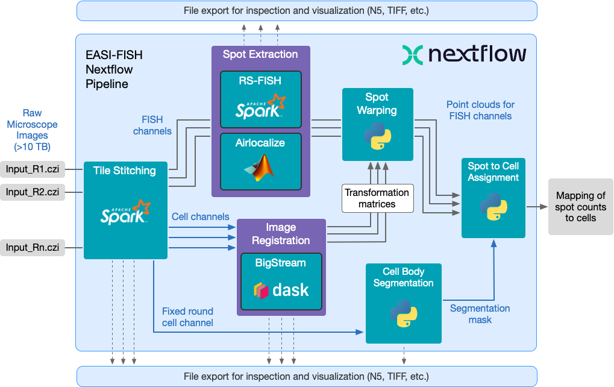

# EASI-FISH Analysis Pipeline

> [!WARNING]
> This pipeline is under development.
> For the legacy EASI-FISH Nextflow pipeline see <https://github.com/JaneliaSciComp/multifish>

## Introduction

**JaneliaSciComp/easifish** is a bioimage analysis pipeline that reconstructs large microscopy image volumes. It ingests raw images in CZI format from Zeiss Lightsheet microscopes, computes tile stitching, and outputs a multi-resolution image pyramid in OME-ZARR or N5 format. The pipeline also supports registration to a reference round as well as segmentation of selected rounds.



1. Stitch the image tiles from the source CZI using either [Saalfeld stitcher](https://github.com/saalfeldlab/stitching-spark) or [BigStitcher](https://github.com/JaneliaSciComp/bigstitcher-spark)
2. Register low resolution moving rounds with respect to the corresponding low resolution fixed round using [Bigstream](https://github.com/JaneliaSciComp/bigstream).
3. Register high resolution moving rounds with respect to the corresponding low resolution fixed round using [Bigstream](https://github.com/JaneliaSciComp/bigstream).
4. Apply deformation to the specified scale of the moving image using [Bigstream](https://github.com/JaneliaSciComp/bigstream).
5. Generate multiscale pyramid for the warped moving image.
4. Generate the segmentation for the selected round(s) using [Cellpose](https://github.com/MouseLand/cellpose).
5. Extract the spots from the stitched images using either [RS-FISH](https://github.com/PreibischLab/RS-FISH-Spark) or [FISHSPOT](https://github.com/GFleishman/fishspot)

## Usage

> **Note**
> If you are new to Nextflow and nf-core, please refer to [this page](https://nf-co.re/docs/usage/installation) on how
> to set-up Nextflow. Make sure to [test your setup](https://nf-co.re/docs/usage/introduction#how-to-run-a-pipeline)
> with `-profile test` before running the workflow on actual data.

First, prepare a samplesheet with your input data that looks as follows:

`samplesheet.csv`:

```csv
id,filename,pattern
LHA3_R3_tiny,LHA3_R3_small.czi,LHA3_R3_small.czi
LHA3_R3_tiny,LHA3_R3_tiny.mvl,
LHA3_R5_tiny,LHA3_R5_small.czi,LHA3_R5_small.czi
LHA3_R5_tiny,LHA3_R5_tiny.mvl,
```

Each row represents a file in the input data set. The identifier (`id`) groups files together into acquisition rounds. In the example above, each acquisition is a single CZI file containing all of the tiles and channels, and an MVL file containing the acquisition metadata (e.g. stage coordinates for each tile.)

> **Note:**
> If you use [BigStitcher](https://github.com/JaneliaSciComp/bigstitcher-spark) for the registration the MVL is not required, for [Saalfeld stitcher](https://github.com/saalfeldlab/stitching-spark) you must have it.
> Also with [BigStitcher](https://github.com/JaneliaSciComp/bigstitcher-spark) the samplesheet.csv may have the BDV project file (dataset.xml), and then you can skip the stitching step and only run create-container and fuse.


Now, you can run the pipeline using:

```bash
nextflow run JaneliaSciComp/easifish \
   -profile <docker/singularity/.../institute> \
   --input samplesheet.csv \
   --outdir <OUTDIR>
```

:::warning
Please provide pipeline parameters via the CLI or Nextflow `-params-file` option. Custom config files including those
provided by the `-c` Nextflow option can be used to provide any configuration _**except for parameters**_;
see [docs](https://nf-co.re/usage/configuration#custom-configuration-files).
:::

For more details and further functionality, please refer to the [usage documentation](https://nf-co.re/easifish/usage) and the [parameter documentation](https://nf-co.re/easifish/parameters).

## Stitching

The pipeline supports two stitching methods, selected via `--stitching_method`:

- **BigStitcher** (default) — Uses [bigstitcher-spark](https://github.com/JaneliaSciComp/bigstitcher-spark). Recommended for most cases. Does not require an MVL file. Supports specify which stitching steps to run using `--bigstitcher_steps` parameter. For each step you can provide additional parameters in a YAML file like [bigsticher_conf.yml](conf/bigstitcher_config.yml).
- **SaalfeldStitcher** — Uses [stitching-spark](https://github.com/saalfeldlab/stitching-spark). Requires an MVL file with stage coordinates.

Both methods use Apache Spark for distributed processing. Key Spark parameters:

| Parameter | Default | Description |
|-----------|---------|-------------|
| `--spark_workers` | 10 | Number of Spark worker processes |
| `--spark_worker_cores` | 1 | CPU cores per worker |
| `--spark_gb_per_core` | 15 | Memory (GB) allocated per core |
| `--spark_driver_mem_gb` | 14 | Memory (GB) for the Spark driver |

Key stitching parameters:

| Parameter | Default | Description |
|-----------|---------|-------------|
| `--stitching_method` | BigStitcher | `BigStitcher` or `SaalfeldStitcher` |
| `--resolution` | 0.23,0.23,0.42 | Voxel resolution in X,Y,Z (microns) |
| `--axis_mapping` | -x,y,z | Axis orientation (`-x` flips the X axis) |
| `--stitching_channel` | all | Channel(s) used for computing tile alignment |
| `--stitching_block_size` | 128,128,64 | N5 block size during tile conversion (X,Y,Z) |
| `--stitching_blur_sigma` | 2 | Gaussian blur sigma applied before alignment |
| `--stitching_result_container` | stitched.n5 | Output container name (`.n5`, `.zarr`, `.h5`) |
| `--skip_stitching` | false | Skip stitching and use pre-stitched data |

## Spot Extraction

The pipeline supports two spot detection methods, selected via `--spots_extraction_method`:

- **RS-FISH** (default) — Uses [RS-FISH-Spark](https://github.com/PreibischLab/RS-FISH-Spark) with a Difference-of-Gaussians (DoG) detector. Fast and straightforward to configure. Runs on a Spark cluster.
- **FISHSPOTS** — Uses [fishspot](https://github.com/GFleishman/fishspot) with a Dask-based distributed backend. Supports PSF estimation and Richardson-Lucy deconvolution for higher accuracy on challenging images. Requires a FISHSPOTS config file (`--fishspots_config`).

By default, spots are extracted from the stitched images. Set `--extract_spots_from_warped true` to extract from the registered (warped) images instead.

Key RS-FISH parameters:

| Parameter | Default | Description |
|-----------|---------|-------------|
| `--rsfish_sigma` | 1.5 | Gaussian sigma for DoG smoothing |
| `--rsfish_threshold` | 0.007 | DoG detection threshold |
| `--rsfish_anisotropy` | 0.7 | Z-anisotropy ratio (voxel_z / voxel_xy) |
| `--rsfish_min_intensity` | 0 | Minimum pixel intensity to consider |
| `--rsfish_max_intensity` | 4096 | Maximum pixel intensity |
| `--rsfish_spark_workers` | 1 | Number of Spark workers for RS-FISH |
| `--rsfish_spark_worker_cores` | 5 | CPU cores per RS-FISH Spark worker |

All RS-FISH detection parameters (`--rsfish_sigma`, `--rsfish_threshold`, etc.) accept comma-separated per-channel values (e.g., `--rsfish_sigma "1.5,2.0,1.5"`).

Key FISHSPOTS parameters:

| Parameter | Default | Description |
|-----------|---------|-------------|
| `--fishspots_config` | conf/fishspots_config.yml | FISHSPOTS algorithm config file |
| `--fishspots_psf_file` | (none) | PSF file for deconvolution (estimated from data if omitted) |
| `--fishspots_intensity_threshold` | 0 | Post-detection intensity threshold |
| `--fishspots_blocksize` | 128,128,128 | Processing block size (X,Y,Z) |
| `--fishspots_dask_workers` | 1 | Number of Dask workers |
| `--fishspots_dask_worker_mem_gb` | 4 | Memory (GB) per Dask worker |

Common spot extraction parameters:

| Parameter | Default | Description |
|-----------|---------|-------------|
| `--spots_extraction_method` | RS_FISH | `RS_FISH` or `FISHSPOT` |
| `--spots_channels` | (all non-DAPI) | Channels to run spot detection on |
| `--dapi_channel` | (auto-detected) | DAPI channel name (excluded from detection) |
| `--extract_spots_from_warped` | false | Extract from warped registered images |
| `--skip_spot_extraction` | false | Skip spot extraction entirely |

## Pipeline output

To see the results of an example test run with a full size dataset refer to the [results](https://nf-co.re/easifish/results) tab on the nf-core website pipeline page.
For more details about the output files and reports, please refer to the
[output documentation](https://nf-co.re/easifish/output).

## Credits

The [stitching-spark tools](https://github.com/saalfeldlab/stitching-spark) used in this pipeline were developed by the [Saalfeld Lab](https://www.janelia.org/lab/saalfeld-lab) at Janelia Research Campus.

The modules for running Spark clusters on Nextflow were originally prototyped by [Cristian Goina](https://github.com/cgoina).

The JaneliaSciComp/easifish pipeline was originally constructed by [Konrad Rokicki](https://github.com/krokicki).

The workflow diagram is based on the SVG source from the [cutandrun](https://github.com/nf-core/cutandrun/) pipeline.

## Contributions and Support

If you would like to contribute to this pipeline, please see the [contributing guidelines](.github/CONTRIBUTING.md).

For further information or help, don't hesitate to get in touch on the [Slack `#easifish` channel](https://nfcore.slack.com/channels/easifish) (you can join with [this invite](https://nf-co.re/join/slack)).

## Citations

<!-- TODO nf-core: Add citation for pipeline after first release. Uncomment lines below and update Zenodo doi and badge at the top of this file. -->

If you use `JaneliaSciComp/easifish` for your analysis, please cite the EASI-FISH article as follows:

> Yuhan Wang, Mark Eddison, Greg Fleishman, Martin Weigert, Shengjin Xu, Fredrick E. Henry, Tim Wang, Andrew L. Lemire, Uwe Schmidt, Hui Yang,
> Konrad Rokicki, Cristian Goina, Karel Svoboda, Eugene W. Myers, Stephan Saalfeld, Wyatt Korff, Scott M. Sternson, Paul W. Tillberg.
> Expansion-Assisted Iterative-FISH defines lateral hypothalamus spatio-molecular organization. Cell. 2021 Dec 22;184(26):6361-6377.e24.
> doi: [10.1016/j.cell.2021.11.024](https://doi.org/10.1016/j.cell.2021.11.024). PubMed PMID: 34875226.

An extensive list of references for the tools used by the pipeline can be found in the [`CITATIONS.md`](CITATIONS.md) file.

This pipeline uses code and infrastructure developed and maintained by the [nf-core](https://nf-co.re) community, reused here under the [MIT license](https://github.com/nf-core/tools/blob/master/LICENSE).

> **The nf-core framework for community-curated bioinformatics pipelines.**
>
> Philip Ewels, Alexander Peltzer, Sven Fillinger, Harshil Patel, Johannes Alneberg, Andreas Wilm, Maxime Ulysse Garcia, Paolo Di Tommaso & Sven Nahnsen.
>
> _Nat Biotechnol._ 2020 Feb 13. doi: [10.1038/s41587-020-0439-x](https://dx.doi.org/10.1038/s41587-020-0439-x).
